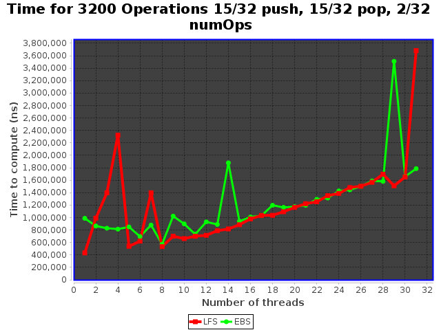

## Overview

Uses java 11

### Dependencies 

Dependencies needed for graphing if compiling and running ESBTest.java. 
No need to install if running from .jar file

jcommon-1.0.23

jfreechart-1.0.19

install instructions here https://www.tutorialspoint.com/jfreechart/jfreechart_installation.htm

dependency .jar files in lib folder 

## Running the tests using the .jar file

java -jar HW3StackElem.jar

Generates a line graph showing the average time it takes to complete 3200 operations. The graph compares the lock free stack (LFS) I implemented for homework 1 and my implementation of en elimination backoff stack (EBS).

 

This graph was generated on a computer that supports 8 threads. Overhead from excessive threads becomes prohibitive as thread count grows. Also somewhat disappointingly the EBS did not seem improve performance over the LFS.     