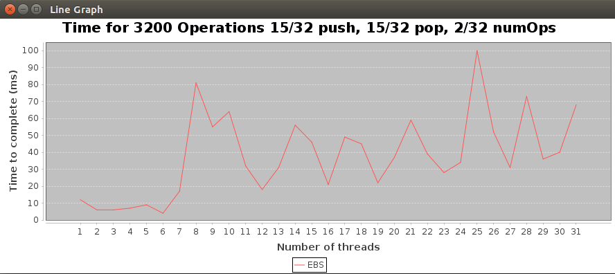

## Overview

Uses java 11

### Dependencies 
No need to install if running from .jar file

jcommon-1.0.23

jfreechart-1.0.19

install instructions here https://www.tutorialspoint.com/jfreechart/jfreechart_installation.htm

dependency .jar files in lib folder 

## Running the tests using the .jar file

java -jar HW3StackElem.jar

Generates a line graph showing the time it takes to do 3200 operations.

 
This graph was generated on a 4 core computer. Overhead from excessive threads becomes prohibitive as thread count grows.   